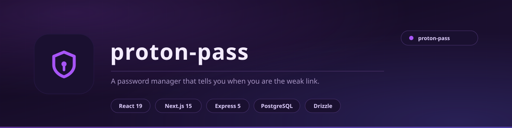

<div align="center">

<picture>
  <source media="(prefers-color-scheme: light)" srcset="docs/assets/banner-light.svg">
  <source media="(prefers-color-scheme: dark)" srcset="docs/assets/banner.svg">
  
</picture>

<br>

**A password manager that tells you when you are the weak link.**

Vaults, every item type you actually use, a generator, and a security centre that surfaces the passwords you reused and the ones that would fall in seconds.

<br>


<br>

[**Features**](#features) &nbsp;&nbsp;|&nbsp;&nbsp; [**Architecture**](#architecture) &nbsp;&nbsp;|&nbsp;&nbsp; [**Running it**](#running-it) &nbsp;&nbsp;|&nbsp;&nbsp; [**API**](#api) &nbsp;&nbsp;|&nbsp;&nbsp; [**Schema**](#database-schema)

<br>

> **Not affiliated with Proton AG.** This is an independent educational build - a study of how a modern password manager is put together, not a Proton product and not a drop-in replacement for one.

</div>

---

## What it is

A password manager is mostly plumbing: store secrets, retrieve them, never leak them. The interesting part is what you do *around* that.

This one has two front ends over one shared API - a React + Vite app and a Next.js 15 app - so the same backend serves both and neither owns the logic. Item types cover what people actually store: logins, cards, identities, secure notes and aliases. And the security centre does the job most managers skip: it goes looking for your bad habits.

<div align="center">

|  |  |
|:---|:---|
| **Front ends** | React 19 + Vite · Next.js 15 (App Router) |
| **Backend** | Express 5 + pino logging |
| **Database** | PostgreSQL via Drizzle ORM |
| **Validation** | Zod + OpenAPI-generated schemas |
| **Monorepo** | pnpm workspaces, Node 24 |
| **API contract** | OpenAPI spec is the source of truth; hooks and validators are generated |

</div>

---

## Features

### Vaults

- **Multiple vaults** with name, description, colour and icon
- **Full CRUD** on every vault, and items are scoped to the vault they belong to
- **Filter items** by vault, type, trashed state, pinned state, or free-text search

### Item types

| Type | Fields |
|:---|:---|
| **Login** | username, password, multiple URLs, TOTP, note |
| **Card** | cardholder, number, expiry, CVV, card type |
| **Identity** | first and last name, email, phone, address, city, country |
| **Note** | free text |
| **Alias** | alias email |

Any item can be **pinned** for quick access or moved to **trash** without deleting it outright.

### Generator

- **Password generator** - length and character-set control
- **Passphrase generator** for the ones you have to type by hand
- **Strength scorer** that grades a password, so the app can tell you when a stored secret is weak

### Security centre

- **Weak passwords** - every login whose stored password scores badly
- **Reused passwords** - grouped, so you can see exactly which accounts share a secret
- **Dashboard stats** for the whole vault at a glance

---

## Architecture

```
artifacts/
  api-server/          Express 5 + Drizzle backend   (port 8080, serves /api)
  proton-pass-next/    Next.js 15 front end          (port 3001)
  proton-pass/         React + Vite front end        (port 3002)
  mockup-sandbox/      Vite component preview
lib/
  db/                  PostgreSQL schema - vaults, items
  api-spec/            OpenAPI spec (source of truth)
  api-zod/             Generated Zod schemas
  api-client-react/    Generated React Query hooks
```

Both front ends talk to the same Express API. The Next.js app proxies to it through its own API routes, which keeps the anon key off the client entirely.

---

## Running it

```bash
# install
pnpm install

# generate the API client from the OpenAPI spec
pnpm --filter @workspace/api-spec run codegen

# database
pnpm --filter @workspace/db run push

# API server
pnpm --filter @workspace/api-server run dev

# Next.js front end
PORT=3001 pnpm --filter @workspace/proton-pass-next run dev

# React + Vite front end
PORT=3002 BASE_PATH=/ pnpm --filter @workspace/proton-pass run dev
```

### Environment

| Variable | Purpose |
|:---|:---|
| `DATABASE_URL` | PostgreSQL connection string |
| `SESSION_SECRET` | Session encryption secret |
| `INSFORGE_BASE_URL` | Backend base URL |
| `INSFORGE_API_KEY` | Backend admin key - server-side only |
| `INSFORGE_ANON_KEY` | Anon key (not required - the Next.js routes proxy to Express) |

> **Never commit a real value for any of these.** Keep them in `.env` (git-ignored) or your host's secret store.

---

## API

| Method | Path | Purpose |
|:---|:---|:---|
| `GET` | `/api/healthz` | Health check |
| `GET` `POST` | `/api/vaults` | List / create vaults |
| `GET` `PATCH` `DELETE` | `/api/vaults/:id` | Read / update / delete a vault |
| `GET` `POST` | `/api/items` | List / create items - `?vaultId` `?type` `?trashed` `?search` `?pinned` |
| `GET` `PATCH` `DELETE` | `/api/items/:id` | Read / update / delete an item |
| `GET` | `/api/stats` | Dashboard statistics |
| `GET` | `/api/stats/weak-passwords` | Logins with weak passwords |
| `GET` | `/api/stats/reused-passwords` | Reused passwords, grouped |
| `POST` | `/api/generator/password` | Generate a password |
| `POST` | `/api/generator/passphrase` | Generate a passphrase |
| `POST` | `/api/generator/score` | Score a password |

---

## Database schema

**`vaults`** - id, name, description, color, icon, created_at, updated_at

**`items`** - id, vault_id, type, title, username, password, urls (JSON), note, cardholder_name, card_number, expiration_date, cvv, card_type, first_name, last_name, email, phone, address, city, country, alias_email, totp, pinned, trashed, password_score, last_used_at, created_at, updated_at

---

## Security notes

This is a **learning project**, and it is honest about that:

- Passwords are stored in the database as entered - there is **no client-side encryption layer** like a production manager has. Do not put real credentials in it.
- Session handling uses a server-side secret; keep `SESSION_SECRET` out of the repository.
- The backend admin key is server-side only and must never reach the browser.

If you want a real password manager, use a real password manager.

---

## Licence

MIT - see [LICENSE](LICENSE).

Built by **Aizenrex x Riyad**.
